# Analyzing eCommerce Business Performance with SQL

## Overview 
Dalam suatu perusahaan mengukur performa bisnis sangatlah penting untuk melacak, memantau, dan menilai keberhasilan atau kegagalan dari berbagai proses bisnis. Oleh karena itu, dalam paper ini akan menganalisa performa bisnis untuk sebuah perusahan eCommerce,  dengan memperhitungkan beberapa metrik bisnis yaitu pertumbuhan pelanggan, kualitas produk, dan tipe pembayaran

##  Technologies
- PostgreSQL
- Excel

## Prerequisite
1.  Download dataset  [eCommerce](https://drive.google.com/file/d/1_zbdzh6KkRerEZZrzfVfYC6Vwnev1gUu/view?usp=share_link)
2.  Install  [PostgreSQL](https://www.postgresql.org/download/)

## Project step
1. Data Preparation
2. ERD eCommerce
3. Annual Customer Activity Growth Analysis
4. Annual Product Category Quality Analysis
5. Analysis of Annual Payment Type Usage

[link untuk melihat query](https://docs.google.com/document/d/13jPrcrh7s3BAK7NAppJ3TsLr6mXgXNPR1pWo2Pxe_i4/edit?usp=sharing)

### 1. Data Preparation
kita dapat membuat table nya dulu di postgreSQL dan kita perhatikan juga tipe datanya, kita pastikan tipe datanya sesuai dengan table table dataset. kita dapat melihat dulu dataset nya menggunakan excel untuk memastikan isi dari data set tersebut sudah sesuai agar tipe data nya tidak salah.
setelah di buat tabel - tabel nya kita import dataset nya ke SQL menggunakan fiture import yang ada di postgreSQL. setelah itu kita select masing masing table untuk mengecek apakah dataset sudah ter-import dengan benar atau belum.

### 2. ERD eCommerce
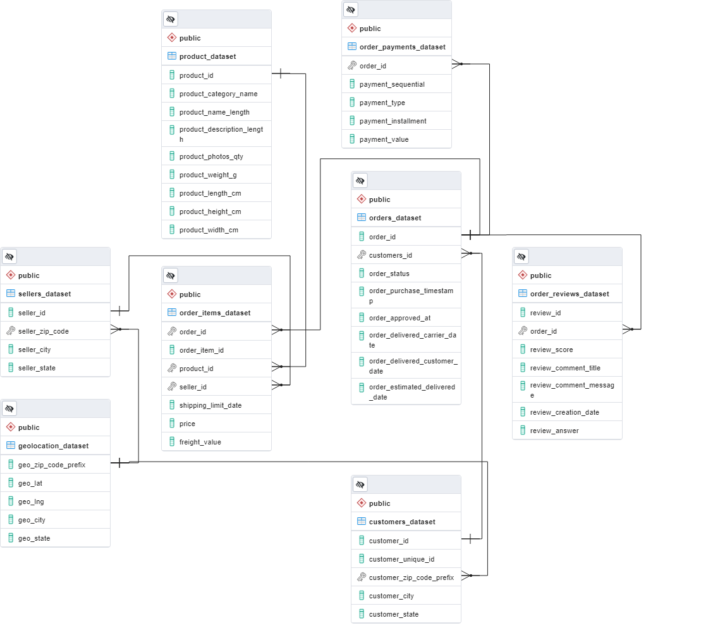
Create ERD di UI PgAdmin  dengan  cara generate ERD dan menambahakan masing- masing relasinya. dari ERD ini kita dapat melihat hubungan tiap tabel.

###  3. Annual Customer Activity Growth Analysis
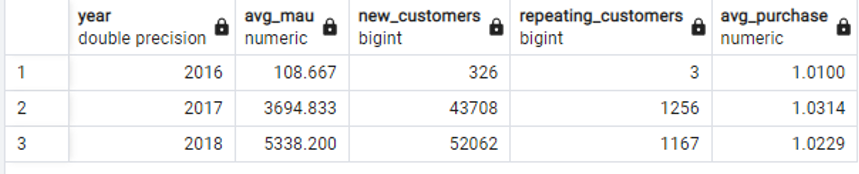
Dapat  dilihat data pertahun  dari
●rata-rata user aktif (avg_mau)
●kostumer  baru (new_customers)
●customer yang melakukan  pembelian  berulang (repeating_customers)
●rata rata pembelian per customer (avg_purchase)

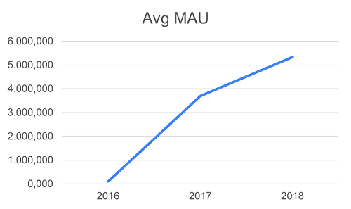 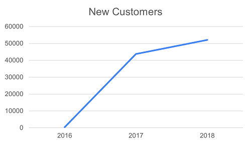
Data tahun 2016 hanya  ter record dari  bulan September sehingga  mengakibatkan data tidak  seimbang, akan  tetapi  kalau  dilihat  dari  tahun 2017 dan 2018 jumlah  aktif  kostumer dan kostumer  baru  terlihat  mengalami  kenaikan.
Jumlah  aktif  kostumer  memiliki  korelasi  positif  dengan  kostumer  baru.

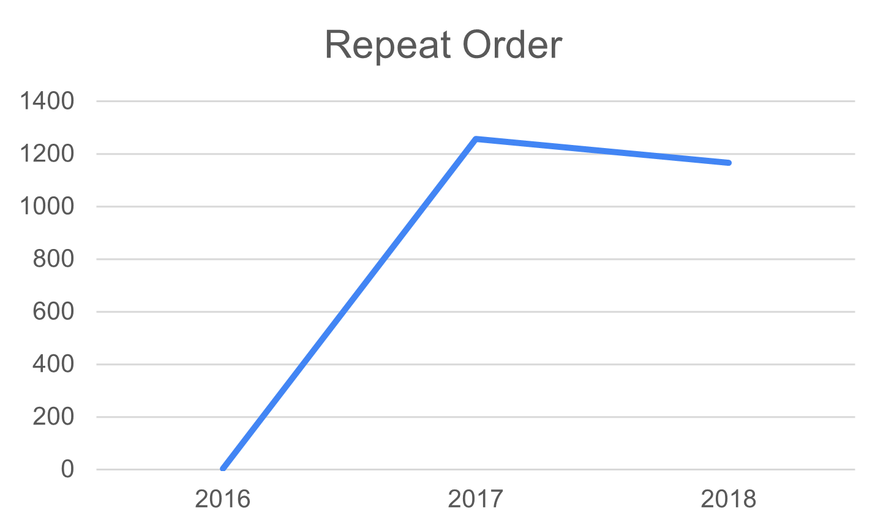 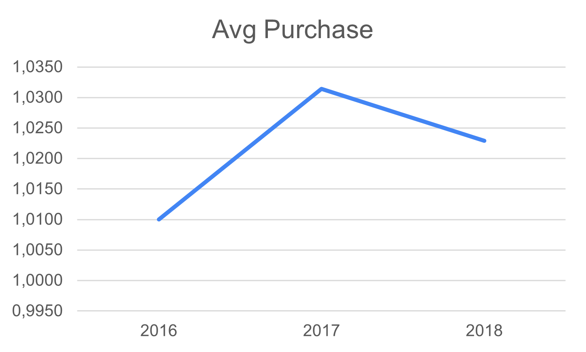
Walaupun  jumlah  kostumer  aktif dan kostumer  baru  nya  mengalami  peningkatan, Repeat order dan rata-rata pembeliannya  tidak  ikut naik, malahan  cenderung  menurun. Ada kemungkinan  kostumer  hanya  melihat  lihat  saja  namun  tidak  membeli, atau  adanya  akun  akun  palsu  atau bot.
solusinya  bisa di berikan promo promo  untuk  kostumer yang hanya  melihat  lihat  saja, dan membersihkan  akun  akun  palsu  atau bot

### 4. Annual Product Category Quality Analysis
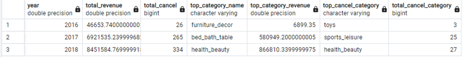
Berikut data yang di dapat:
year : tahun  berjalan  nya
total_revenue : Total keseluruhan Revenue tiap  tahun  nya
total_cancel : total keseluruhan order yang di cancel tiap  tahun  nya
top_category_name: nama  kategori yang memiliki revenue tertinggi
top_category_revenue: jumlah revenue per category tiap  tahun  nya
top_cancel_category : nama category dengan cancel order tertinggi
total_cancel_category: jumlah order yang di cancel per category tiap  tahunnya

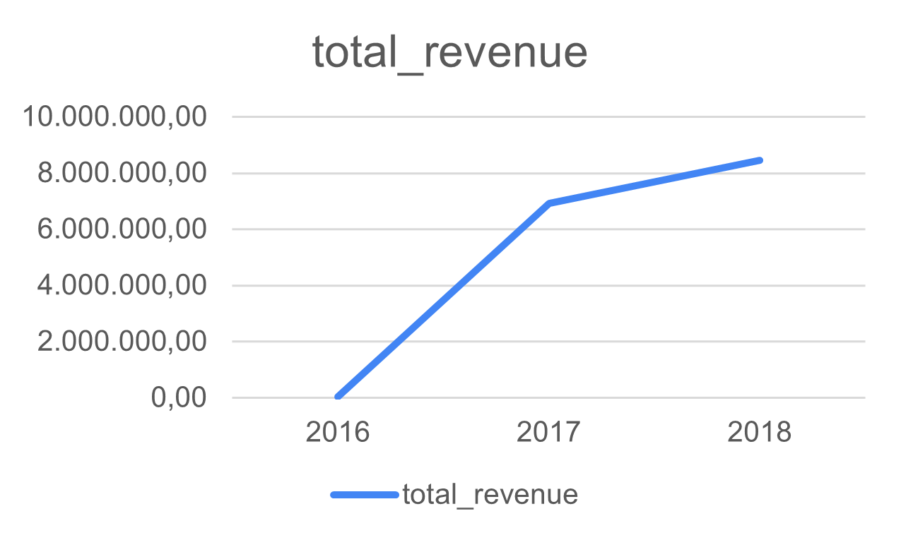 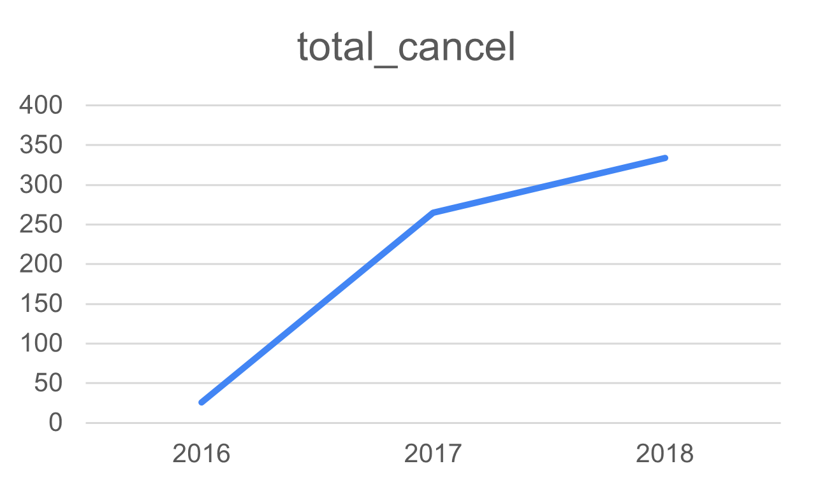
Dapat di lihat  dari  grafik  diatas  bahwa Total Revenue selalu naik tiap  tahun  nya, akan  tetapi total order yang di cancel juga ikut naik.

Dan dapat di simpulkan  bahwa  semakin  tinggi Revenue yang di dapat, akan  semakin  tinggi pula tingkat order yang di cancel.

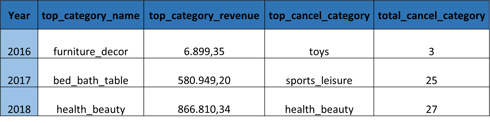
Kategori yang memiliki revenue tertinggi dan kategori yang memiliki cancel order tertinggi  megalami  perubahan  tiap  tahun  nya.

Hal yang menarik  adalah pada tahun 2018 Kategori yang memiliki revenue tertinggi dan kategori yang memiliki cancel order tertinggi  sama-sama  health_beauty

### 5. Analysis of Annual Payment Type Usage
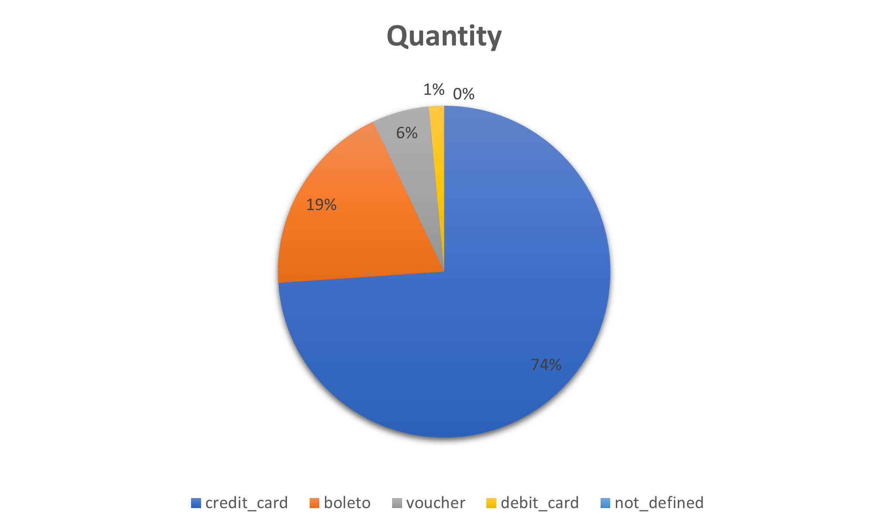  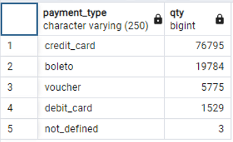

Ranking type payment terfavorite (paling banyak di pakai) di semua  transaksi dan semua  tahun.
credit_card  menjadi type payment paling banyak di gunakan.

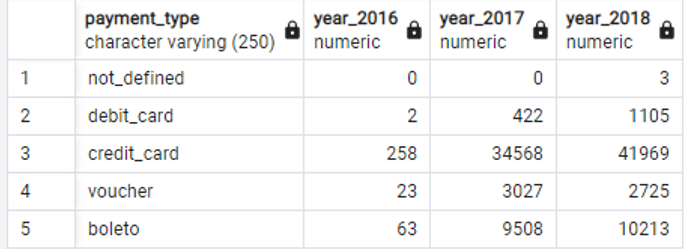

Table di atas  menunjukan detail dari  tipe payment yang telah di gunakan  pelanggan  tiap  tahun  nya

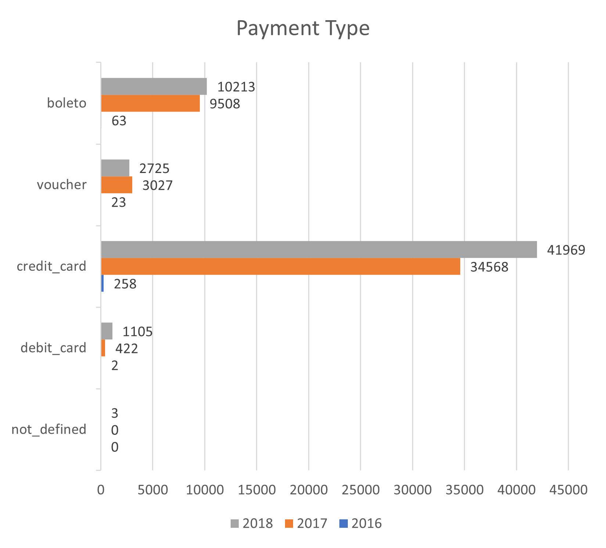

secara  keseluruhan  metode credit card yang paling banyak di gunakan  tiap  tahun  nya  untuk  melakukan  pembayaran.

Tiap  kategori juga selalu  meningkat  kecuali  metode voucher yang mengalami  penurunan  dari  tahun 2017 ke 2018.

Mungkin  dikarenakan  kurang  menarik  nya voucher yang di tawarkan  atau  kurang  nya  variasi  vocher yang di tawarkan.

[link untuk melihat query](https://docs.google.com/document/d/13jPrcrh7s3BAK7NAppJ3TsLr6mXgXNPR1pWo2Pxe_i4/edit?usp=sharing)

